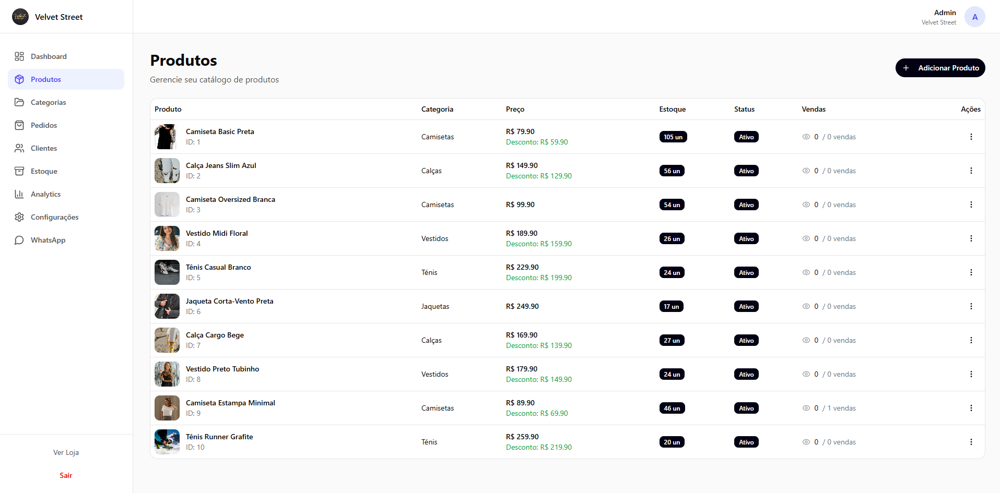
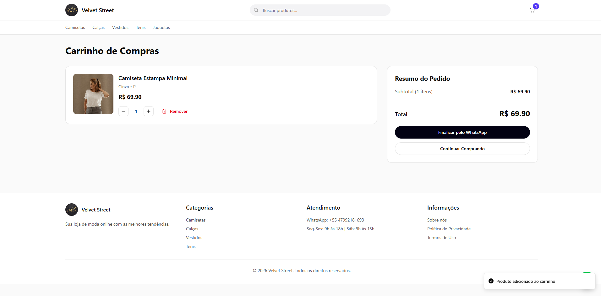
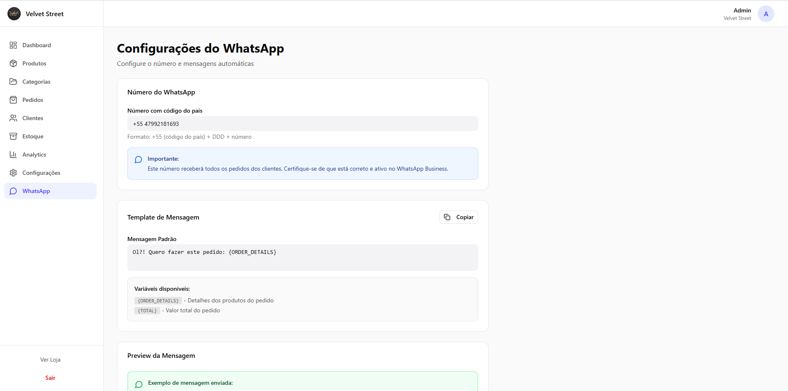
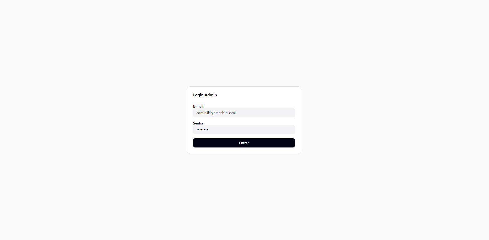
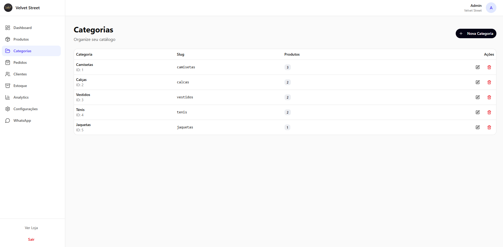
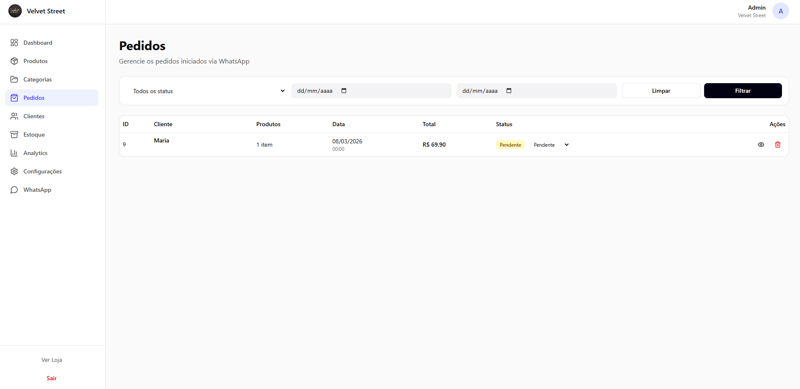
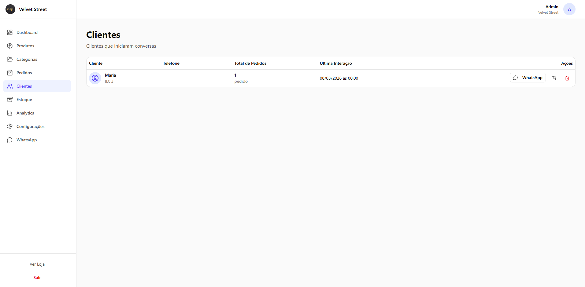
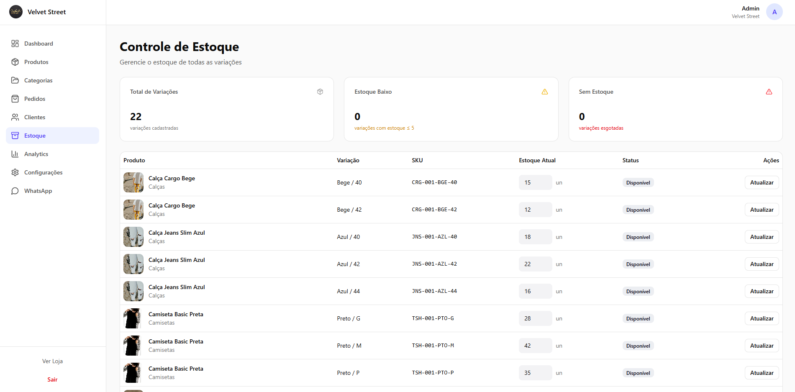
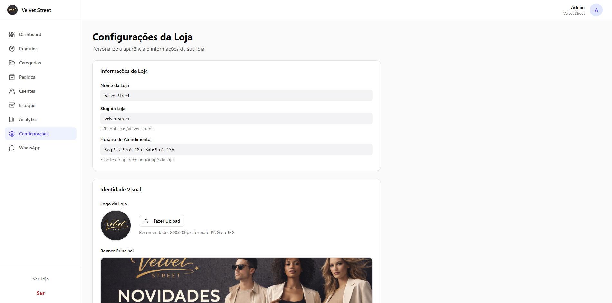
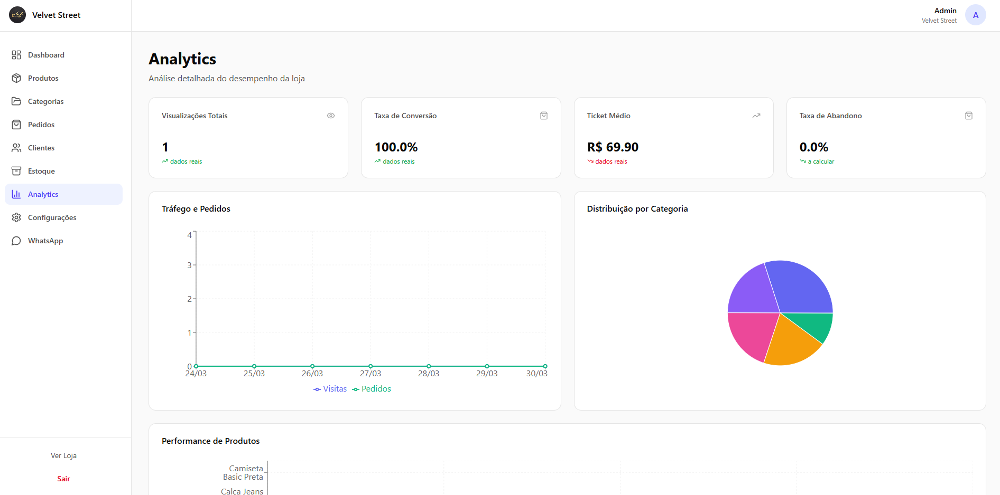

# Vayla


Plataforma de e-commerce multi-tenant para lojas de moda, com vitrine pública, painel administrativo e fechamento de pedidos via WhatsApp.

## Visão geral

O projeto está dividido em dois módulos principais:

- `frontend/`: aplicação React + Vite com catálogo da loja e painel admin.
- `backend/`: API em Go com autenticação, catálogo, pedidos, estoque, clientes e integrações de storage.

O fluxo principal é:

1. A loja publica produtos e categorias no painel administrativo.
2. O cliente navega pela vitrine, visualiza detalhes e adiciona itens ao carrinho.
3. O checkout gera o pedido internamente e abre a conversa no WhatsApp com a mensagem pronta.
4. O painel acompanha pedidos, clientes, estoque e métricas da loja.

## Principais funcionalidades

- Multi-tenant por `store_id`, `slug`, subdomínio e resolução por domínio.
- Catálogo público com categorias, listagem e página de produto.
- Carrinho e checkout por WhatsApp.
- Login administrativo por loja com JWT.
- Gestão de produtos, categorias, estoque, pedidos e clientes.
- Dashboard e analytics para a operação da loja.
- Upload de imagens para logo, banner, galeria e produtos.
- Seed inicial com loja demo pronta para uso.

## Stack

### Frontend

- React 18
- React Router 7
- Vite 6
- Tailwind CSS 4
- Radix UI
- MUI Icons

### Backend

- Go 1.23
- Gin
- PostgreSQL 16
- Redis 7
- Docker Compose
- AWS SDK v2 compatível com S3/Object Storage

## Estrutura do repositório

```text
vayla/
|-- backend/
|   |-- cmd/api              # entrada da API
|   |-- internal/            # handlers, services, repositories e models
|   |-- migrations/          # scripts SQL
|   |-- schema.sql           # schema inicial
|   |-- seed.sql             # dados iniciais
|   |-- docker-compose.yml
|   `-- .env.example
|-- frontend/
|   |-- src/app/pages/
|   |   |-- storefront/      # home, produto, carrinho, checkout
|   |   `-- admin/           # dashboard, pedidos, estoque, clientes etc.
|   |-- src/app/components/
|   `-- package.json
`-- docs/
    `-- screenshots/
```

## Módulos e telas

### Storefront

- Home da loja
- Página de produto
- Carrinho
- Finalização via WhatsApp

### Admin

- Login
- Dashboard
- Produtos
- Categorias
- Pedidos
- Clientes
- Estoque
- Analytics
- Configurações da loja
- Configurações de WhatsApp

## Como rodar o projeto

### Pré-requisitos

- Node.js 18+
- npm
- Go 1.23+
- Docker + Docker Compose

### 1. Subir backend

Entre em `backend/`, copie o arquivo de ambiente e suba os serviços:

```powershell
cd backend
Copy-Item .env.example .env
docker compose up -d
go run ./cmd/api
```

Alternativa com `Makefile`:

```powershell
cd backend
Copy-Item .env.example .env
make up
make run
```

Alternativa com script PowerShell do projeto:

```powershell
cd backend
Copy-Item .env.example .env
.\run-local.ps1
```

Serviços expostos:

- API: `http://localhost:8080`
- Adminer: `http://localhost:8081`
- PostgreSQL: porta `4567` no host por padrão
- Redis: porta `6379`

### 2. Subir frontend

Em outro terminal:

```powershell
cd frontend
@"
VITE_API_URL=http://localhost:8080
VITE_STORE_ID=1
VITE_STORE_SLUG=loja-modelo
"@ | Set-Content .env
npm install
npm run dev
```

Frontend disponível em:

- `http://localhost:5173`

## Variáveis de ambiente

### Backend

Arquivo base: `backend/.env.example`

Variáveis principais:

- `APP_PORT=8080`
- `DB_HOST=localhost`
- `DB_PORT=5432`
- `DB_USER=postgres`
- `DB_PASSWORD=postgres`
- `DB_NAME=multi_tennet`
- `REDIS_HOST=localhost`
- `REDIS_PORT=6379`
- `REDIS_PASSWORD=redispass`
- `JWT_SECRET=change-me`
- `BASE_URL=http://localhost:8080`

Variáveis para upload em object storage:

- `ORACLE_REGION`
- `ORACLE_NAMESPACE`
- `ORACLE_BUCKET_NAME`
- `ORACLE_ACCESS_KEY_ID`
- `ORACLE_SECRET_ACCESS_KEY`
- `ORACLE_S3_ENDPOINT`
- `ORACLE_PUBLIC_BASE_URL`
- `MAX_FILE_SIZE`

### Frontend

- `VITE_API_URL=http://localhost:8080`
- `VITE_STORE_ID=1`
- `VITE_STORE_SLUG=loja-modelo`

## Dados seed e acesso inicial

O banco já possui uma loja demo e usuário admin no seed:

- Loja: `Loja Modelo`
- Slug: `loja-modelo`
- Store ID: `1`
- Admin e-mail: `admin@lojamodelo.local`
- Admin senha: `admin123`

URLs úteis:

- Loja pública: `http://localhost:5173/loja-modelo`
- Admin login: `http://localhost:5173/stores/id/1/admin/login`
- Admin raiz: `http://localhost:5173/stores/id/1/admin`

## Endpoints principais

### Públicos

- `GET /health`
- `GET /stores/{slug}`
- `GET /stores/id/{storeID}`
- `GET /stores/resolve-domain?host=...`
- `GET /stores/{slug}/categories`
- `GET /stores/{slug}/products`
- `GET /stores/{slug}/products/{productSlug}`
- `GET /stores/{slug}/banner-settings`
- `GET /stores/{slug}/whatsapp-settings`
- `POST /checkout/whatsapp`
- `POST /tracking/visit`

### Administrativos

- `POST /stores/id/{storeID}/admin/login`
- `GET /stores/id/{storeID}/admin/dashboard`
- `GET /stores/id/{storeID}/admin/analytics`
- CRUD de produtos em `/stores/id/{storeID}/admin/products`
- CRUD de categorias em `/stores/id/{storeID}/admin/categories`
- Gestão de pedidos em `/stores/id/{storeID}/admin/orders`
- Gestão de clientes em `/stores/id/{storeID}/admin/customers`
- Gestão de estoque em `/stores/id/{storeID}/admin/inventory`
- Configurações da loja em `/stores/id/{storeID}/admin/store`
- Configurações de WhatsApp em `/stores/id/{storeID}/admin/whatsapp-settings`
- Upload de imagem em `/stores/id/{storeID}/admin/upload/image`

Especificação OpenAPI:

- `backend/openapi.yaml`

## Exemplo de checkout

```json
{
  "store_id": 1,
  "customer_name": "Maria Silva",
  "customer_phone": "11999999999",
  "items": [
    {
      "product_id": 1,
      "variant_id": 2,
      "quantity": 2
    }
  ]
}
```

Resposta esperada:

```json
{
  "success": true,
  "data": {
    "order_id": 1,
    "whatsapp_message": "Olá! Quero fazer este pedido: ...",
    "whatsapp_url": "https://wa.me/5511999999999?text=..."
  }
}
```

## Banco de dados

Arquivos relevantes:

- `backend/schema.sql`: estrutura inicial
- `backend/seed.sql`: carga inicial
- `backend/migrations/001_init.sql`
- `backend/migrations/002_seed.sql`
- `backend/migrations/003_categories_unique_name.sql`

Comandos úteis:

```powershell
cd backend
make migrate
make seed
make psql
make logs
```

## Galeria

### Fluxo público

| Tela | Imagem |
|---|---|
| Tela inicial da loja |  |
| Produtos |  |
| Compra de item |  |
| Carrinho |  |
| Finalizar pedido |  |
| WhatsApp |  |
| WhatsApp 2 |  |

### Fluxo administrativo

| Tela | Imagem |
|---|---|
| Login |  |
| Dashboard 1 |  |
| Dashboard 2 |  |
| Categorias |  |
| Produtos |  |
| Pedidos |  |
| Clientes |  |
| Estoque |  |
| Configuração |  |
| Configuração 2 |  |
| Analista / Analytics |  |

## Desenvolvimento

### Backend

```powershell
cd backend
go run ./cmd/api
```

### Frontend

```powershell
cd frontend
npm run dev
```

Build do frontend:

```powershell
cd frontend
npm run build
```

## Observações importantes

- O projeto não possui suíte de testes configurada na raiz neste estado atual.
- O frontend depende do backend ativo para autenticação, catálogo e painel administrativo.
- O seed foi preparado para `store_id=1`, então esse valor deve ser mantido no ambiente local inicial.
- O backend usa Redis e PostgreSQL mesmo em ambiente local.

## Roadmap sugerido

- Adicionar testes automatizados no backend e frontend.
- Versionar contratos da API com exemplos mais completos no OpenAPI.
- Adicionar pipeline de CI para build e validação.
- Formalizar estratégia de deploy para frontend, API e storage.
